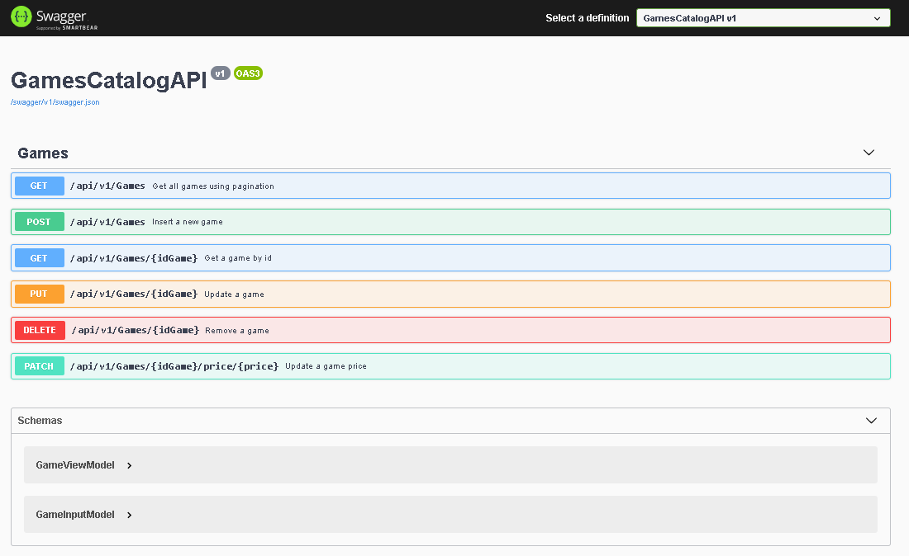

<h1 align="center"> Games Catalog API </h1>

  <a href="#objectives">Objectives</a>&nbsp;&nbsp;&nbsp;|&nbsp;&nbsp;&nbsp;
  <a href="#features">Features</a>&nbsp;&nbsp;&nbsp;|&nbsp;&nbsp;&nbsp;
  <a href="#technologies">Technologies</a>&nbsp;&nbsp;&nbsp;|&nbsp;&nbsp;&nbsp;
  <a href="#license">License</a>

## :computer: Objectives
The objective is to develop a RestAPI solution using .Net 5 by implementing the best architecture software concepts.

## :information_source: Features

- [x] Basic functionalities (Create, Update, Delete, Select) for List
- [x] Basic functionalities (Create, Update, Delete, Select) for Sql Server
- [ ] Basic functionalities (Create, Update, Delete, Select) for Sqlite
- [x] Middleware for exceptions

### :rocket: Technologies

This project was developed as part of the [Avanade CodeAnywhere .NET](https://web.digitalinnovation.one/track/avanade-codeanywhere-net) development program with the following technologies:

-  [Asp .Net Core](https://dotnet.microsoft.com/learn/aspnet/what-is-aspnet-core)
-  [.Net 5.0](https://docs.microsoft.com/en-us/dotnet/core/dotnet-five)
-  [Ado .Net](https://docs.microsoft.com/en-us/dotnet/framework/data/adonet/ado-net-overview)
-  [Swagger](https://docs.microsoft.com/en-us/aspnet/core/tutorials/web-api-help-pages-using-swagger?view=aspnetcore-5.0)

<h1 align="center">
  
</h1>

## :memo: License
This project is under the MIT license. See the [LICENSE](https://github.com/lukemorales/rocketshoes-react-native/blob/master/LICENSE) for more information.

Made with ♥ by Victor Cleber :wave: [Get in touch!](https://www.linkedin.com/in/victor-cleber/?locale=en_US)
